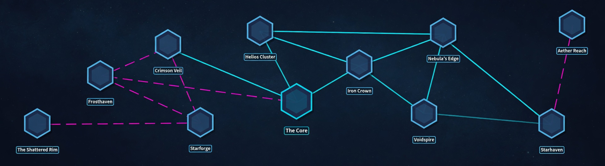

# Stellar Hegemony - Map System (Hybrid Approach)

**Date:** 2026-05-28  
**Status:** Decided

## Overview

We are using a **hybrid map architecture** for the game board.

## Architecture

- **Base Layer**: One large `MeshInstance3D` (PlaneMesh) using a custom procedural shader that generates the nebula + starfield. This provides a continuous, living retro 1950s space background across the entire map.

- **Zone Layer**: Individual zone meshes (or low-poly shapes) that sit on top of the base plane. Each zone is its own node containing:
  - Its own material instance (can share the base starfield shader with per-zone parameter variations)
  - An `Area3D` (or custom `Territory` component) for interaction and data storage
  - Support for additional per-zone art (decals, props, borders, lighting, particles) to give each territory unique personality

## Rationale

This hybrid approach was chosen because it provides the best balance between:
- Visual quality (continuous procedural nebula feel)
- Programming ease (army placement, ownership, clicking, and zone-specific logic are straightforward)
- Artistic flexibility (easy to add unique art and styling per zone while maintaining the Jetson-style boardgame aesthetic)

It supports both regular grids and irregular/unique territory shapes.

## Related Notes
- [[Stellar Hegemony - Sector Map Reference]]
- [[Stellar Hegemony - Core Mechanics]]

## Reference Image

**Note:** This image is the canonical reference for zone placement and connection layout (hyperspace = solid cyan, wormholes = dashed magenta).